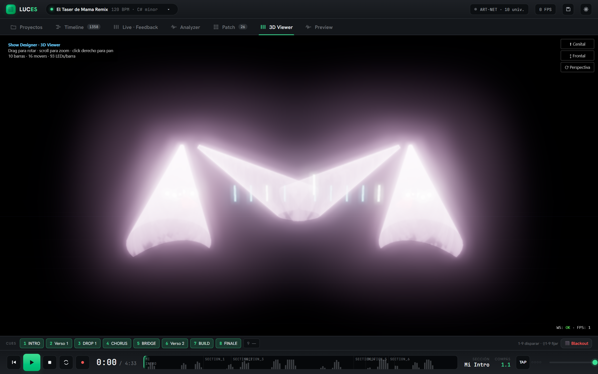
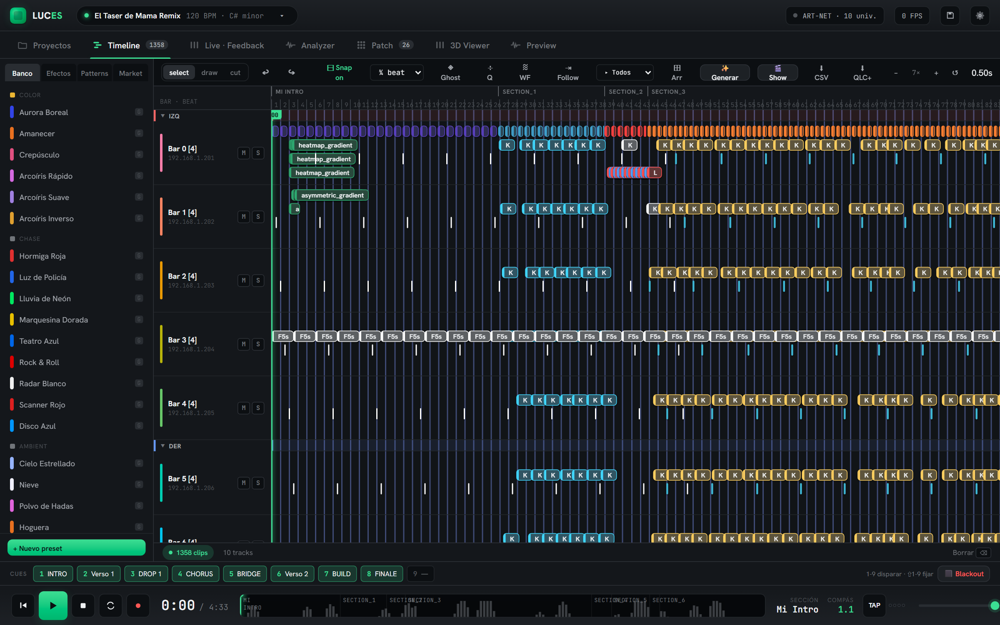
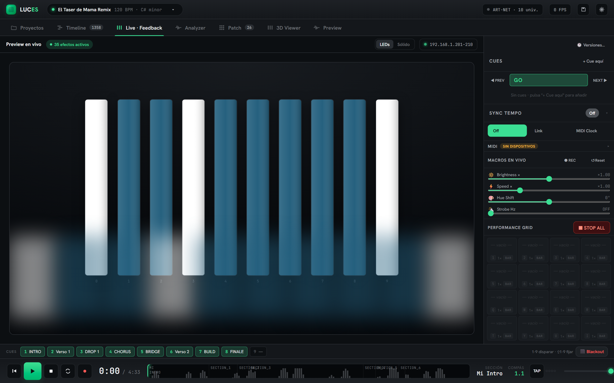
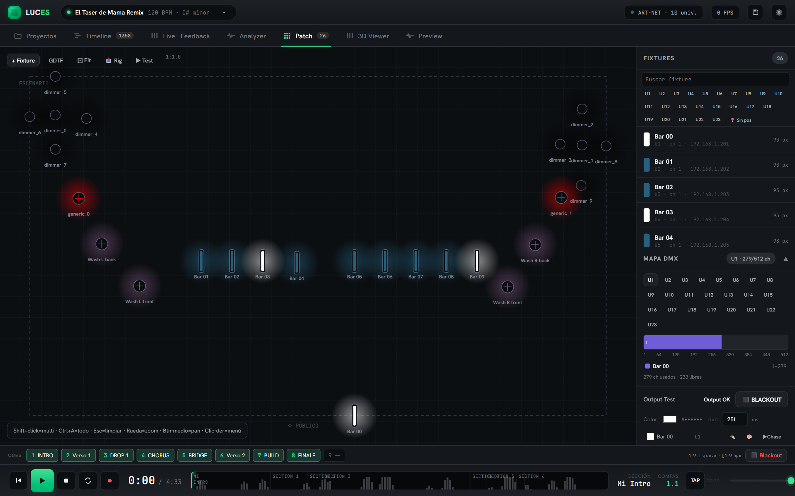
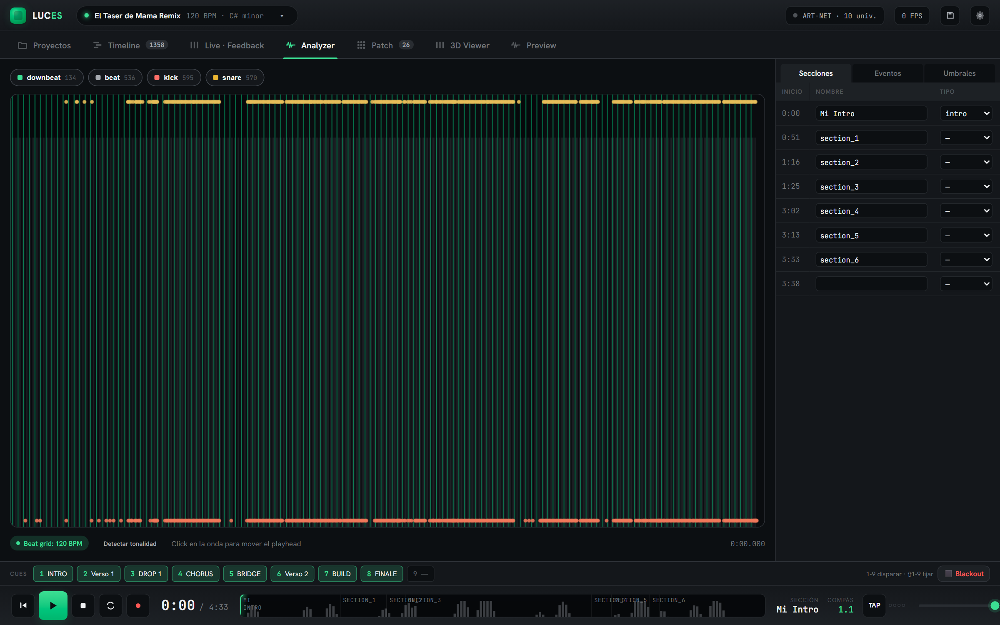

# Show Designer Pro 🎛️

**English** · [Español](README.es.md)

[](https://www.python.org/downloads/)
[](#-quality--tests)
[](https://github.com/guillegar/show_designer/actions/workflows/frontend-ci.yml)
[](LICENSE)
[](CLAUDE.md)

> **Professional lighting software.** Design light choreographies for LED strips and DMX
> fixtures in a visual *timeline* editor (FL Studio / Adobe style), watch them in a real-time
> 3D viewer, and control them by hand (web) or with **Claude** via MCP.

<p align="center">
  
  <br><sub><i>Real-time 3D viewer — 10 LED bars responding live to the DMX output.</i></sub>
</p>

The engine runs **headless** (Python, no Qt) and serves a **React web app**: audio plays on the
PC (master clock) and the browser is control + visualizer. The same backend exposes JSON-RPC so
Claude can drive it over MCP.

```
┌──────────────┐   /ws/control (JSON-RPC)   ┌─────────────────────────┐   Art-Net / sACN / USB
│   Browser    │ ◀────────────────────────▶ │  server/  (FastAPI,      │ ─────────────────────▶ LED strips
│  React + 3D  │   /ws/stream (RGB frames)   │  asyncio, 30 FPS tick)   │                         + DMX fixtures
└──────────────┘                             └───────────▲─────────────┘
                                                         │ JSON-RPC (:9876)
                                                   ┌─────┴─────┐
                                                   │  Claude   │  (MCP)
                                                   └───────────┘
```

---

## ✨ What you can do

| | |
|---|---|
| 🎬 **Timeline editor** | Multitrack, clip *drag-drop*, *snap* to beats, *undo/redo*, layers, reusable patterns, parameter automation and modulation |
| 💡 **LED effects** | Built-in *pixel* effect library + **auto-discovered plugin** system (18 plugins, 25+ effects) — flash, waves, gradients, fire, scanner, VU, image/video pixel-mapping… |
| 🎯 **Per-channel DMX** | *Channel effects* for moving heads / wash / beam / strobe (pan-tilt, color, dimmer) with **GDTF** and JSON profiles |
| 🎵 **Audio analysis** | Beats, downbeats, sections, BPM and key (librosa + madmom; optional stem separation via demucs); plus **live analysis** from an audio input |
| 📺 **3D viewer** | Real-time Three.js (bloom + fog), LED bars + movers that respond to the DMX output |
| 🤖 **Claude control** | 150+ JSON-RPC commands over MCP — ask Claude to generate or edit the show in natural language |
| 🎚️ **Live** | Live macros, performance grid, professional cues, MIDI, OSC I/O, tempo sync (tap / Link / MIDI Clock), rule-based auto-VJ |
| 📤 **Output & export** | Art-Net, **sACN E1.31**, **ENTTEC Open DMX USB**; patch export to PDF, DMX to CSV, **QLC+ XML**, video preview (GIF/MP4) and backup/restore *bundle* |
| 🌐 **Integration** | Public REST API (`/api/v1`), webhooks (HMAC) and multi-user mode with roles |

---

## 📸 Screenshots

|  |  |
|:---:|:---:|
| **Timeline editor** — multitrack, drag-drop clips, layers, patterns, waveform | **Live** — cues, live macros, tempo sync, performance grid |
|  |  |
| **Patch** — 2D stage, DMX channel map, per-fixture output test | **Analyzer** — beats, downbeats, sections, BPM & key |

---

## 🚀 Quick start

**Requirements:** Python 3.11+, Windows 10/11 (Linux/macOS not guaranteed). Node 18+ only if you
want to rebuild the frontend.

```powershell
git clone https://github.com/guillegar/show_designer.git
cd show_designer

python -m venv venv311
.\venv311\Scripts\Activate.ps1
pip install -r requirements.txt

python -m server.main          # → http://localhost:8000
```

Open **http://localhost:8000** in your browser. That's it: the backend serves the already-built
frontend (`web/dist`).

**Frontend development** (hot-reload, optional):

```powershell
cd web
npm install
npm run dev                    # → http://localhost:5173 (proxies WebSockets to :8000)
npm run build                  # rebuilds web/dist
```

**Launchers (Windows):** `Luces.bat` (clean restart + opens the browser), `Cerrar Luces.bat`
(shuts down). Variants that boot a specific show: `Luces Espana.bat`, `Luces Barras.bat`,
`Luces Red Sun.bat`.

Detailed guide: [`docs/installation.md`](docs/installation.md) · [`docs/quickstart.md`](docs/quickstart.md)

---

## 🖥️ The interface (web)

A single page in the browser, with tabs:

| Tab | Purpose |
|-----|---------|
| **Projects** | Show gallery; swap components (song / rig / sequence / presets / auto-VJ), create and copy |
| **Timeline** | Design the show: effect *drag-drop*, layers, patterns, markers, groups, waveform |
| **Live** | Live: transport, macros, cues, performance grid, offline render, MIDI/OSC |
| **Analyzer** | Audio analysis: beats, sections, BPM, key |
| **Patch** | Rig editor: fixtures, DMX map, Art-Net/sACN/USB targets, 3D position |
| **Viewer3D / Preview** | Real-time 3D visualization (Three.js) and 2D frame preview |

Guide: [`docs/usage/ui-guide.md`](docs/usage/ui-guide.md) · Shortcuts: [`docs/usage/shortcuts.md`](docs/usage/shortcuts.md)

---

## 🔌 Hardware & outputs

| Output | Status | Notes |
|--------|--------|-------|
| **WLED strips** | ✅ | e.g. 10 bars of 93 LEDs on Art-Net universes 1–10 |
| **Art-Net** | ✅ | per-universe unicast, *routing* in `output_targets.json` |
| **sACN (E1.31)** | ✅ | unicast or multicast |
| **ENTTEC Open DMX (USB)** | ✅ | ENTTEC framing via `pyserial` |
| **DMX fixtures (movers/wash/beam)** | ✅ | GDTF or JSON profiles |

Physical *routing* (universe → WLED / Art-Net node / sACN / USB / simulation) lives in
`output_targets.json`, **separate** from the rig (`rig.json`). Guide: [`docs/hardware.md`](docs/hardware.md).

---

## 🤖 Claude control (MCP)

The backend exposes the same dispatcher JSON-RPC on `:9876` (MCP compat), so Claude can control
the show with `mcp__show-control__*` (configured in `.mcp.json`).

```
You:    "add a strobe drop every 4 bars in the chorus"
Claude: [generates the clips via the dispatcher]   →  they appear on the timeline ✅
```

Details: [`docs/advanced/mcp.md`](docs/advanced/mcp.md).

---

## 🧪 Quality & tests

- **1043 Python tests** (pytest) + **36 frontend tests** (Vitest) — green.
- Frontend with **strict TypeScript** (clean `tsc -b`) + production build (Vite).
- Performance benchmarks marked `@pytest.mark.bench` (per-frame latency budget).
- **CI** (GitHub Actions): the frontend builds and tests on every push — [`.github/workflows/frontend-ci.yml`](.github/workflows/frontend-ci.yml). The Python suite runs locally (heavy audio deps).

```powershell
pytest tests/                         # Python suite
pytest tests/test_session.py -v       # a single file
cd web; npx vitest run; npm run build # frontend
```

More detail: [`docs/development/testing.md`](docs/development/testing.md).

---

## 📦 Structure

```
show_designer/
├── src/core/         # show_engine, timeline_model, fixtures, effects_engine, channel_effects
├── src/analysis/     # audio analysis (librosa + madmom)
├── src/io/           # GDTF loaders, OutputRouter, project_manager, exporters
├── src/mcp/          # JSON-RPC bridge (:9876) + FastMCP server
├── server/           # headless backend: web.py, dispatcher.py, session.py, tick.py …
├── web/              # React + TS + Vite frontend  (web/public/v3d = 3D viewer)
├── plugins/effects/  # effect plugins (IDs ≥1000, auto-discovered)
├── profiles/         # fixture profiles (WLED + GDTF)
├── projects/         # shows: el_taser, el_taser_barras, himno_espana, pista_patinaje, red_sun
├── tests/            # pytest
└── docs/             # documentation (MkDocs)
```

Full map: [`STRUCTURE.md`](STRUCTURE.md). Architecture and decisions: [`CLAUDE.md`](CLAUDE.md)
and [`docs/advanced/architecture.md`](docs/advanced/architecture.md).

---

## 📚 Documentation

| Doc | Contents |
|-----|----------|
| [`CLAUDE.md`](CLAUDE.md) | Deep architecture, design decisions and current status (handoff doc) |
| [`STRUCTURE.md`](STRUCTURE.md) | Directory and file organization |
| [`SETUP.md`](SETUP.md) | Step-by-step installation |
| [`CONTRIBUTING.md`](CONTRIBUTING.md) | How to contribute, PR flow and tests |
| [`docs/`](docs/index.md) | Full site (MkDocs): installation, usage, plugins, REST API, ADRs… |

---

## 🤝 Contributing

Contributions are welcome — read [`CONTRIBUTING.md`](CONTRIBUTING.md). In short: create a branch
(`fix/…` or `feature/…`), keep `pytest tests/` green, lines ≤ 120 columns, and one commit per
coherent change. Questions or big ideas → open a
[Discussion](https://github.com/guillegar/show_designer/discussions).

---

## 📄 License

**Prosperity Public License 3.0.0** — free for personal, educational and open-source use;
commercial use requires a license (includes a 30-day trial period). Full terms in
[`LICENSE`](LICENSE).

**Third-party credits** (Three.js, pygdtf, …): [`web/public/v3d/CREDITS.md`](web/public/v3d/CREDITS.md).

---

<sub>Show Designer Pro — original code. Dependencies are used as libraries and credited.</sub>
